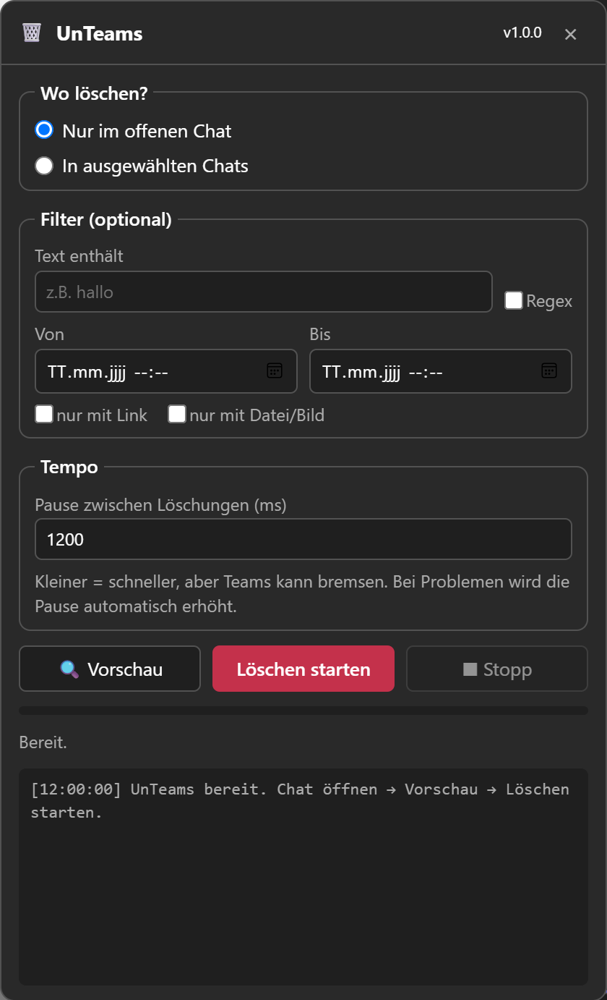

<div align="center">

# 🗑️ UnTeams

**Lösche deine eigenen Microsoft-Teams-Nachrichten automatisch, direkt in der Teams-Desktop-App.**

Nach dem Vorbild von [Undiscord](https://github.com/victornpb/undiscord), nur für Microsoft Teams.

[](https://github.com/ak0f/UnTeams/releases/latest/download/UnTeams.zip)
&nbsp;

&nbsp;




</div>

---

## ✨ Funktionen

- 🖥️ **Läuft in der Teams-Desktop-App.** Kein Browser, kein API-Key, kein Token kopieren.
- 🧹 **Löscht nur deine eigenen Nachrichten.** Fremde Nachrichten werden nie angefasst.
- 💬 **Nur im offenen Chat oder in mehreren Chats** auf einmal, mit Auswahl-Liste und Suche.
- 🔍 **Vorschau (Probelauf):** Zeigt zuerst, was gelöscht würde, und markiert es rot. Dabei wird nichts gelöscht.
- 🎯 **Filter:** Text enthält / Regex, Zeitraum (von–bis), nur mit Link, nur mit Datei/Bild.
- 🐢 **Tempo einstellbar**, mit automatischer Bremse, wenn Teams langsam wird.
- 📊 **Fortschritt, Zähler und Log** in Echtzeit, jederzeit mit **Stopp** abbrechen.
- 🔒 **Sicherheitsabfrage** vor dem Löschen (zweimal klicken).
- 🌗 Passt sich an das **helle oder dunkle** Teams-Design an.

## 📥 Download & Start

> **Voraussetzungen:** Windows 10/11, das **neue Microsoft Teams** (Desktop-App) und [Node.js](https://nodejs.org) ab Version 22 (LTS).

1. **[⬇️ UnTeams.zip herunterladen](https://github.com/ak0f/UnTeams/releases/latest/download/UnTeams.zip)** und entpacken, z.B. nach `Dokumente\UnTeams`.
2. Falls noch nicht vorhanden: **[Node.js LTS](https://nodejs.org)** installieren (einfach immer „Weiter“).
3. Doppelklick auf **`UnTeams.bat`**.

Teams wird kurz neu gestartet. Sobald Teams geladen ist, erscheint unten rechts ein roter **🗑️-Knopf**.

> ℹ️ Das schwarze UnTeams-Fenster muss offen bleiben, solange du das Tool brauchst (minimieren geht). Wenn du es schliesst, läuft Teams normal weiter.

> ⚠️ Windows SmartScreen kann bei `.bat`-Dateien aus dem Internet warnen: **„Weitere Informationen“ → „Trotzdem ausführen“**. Der Code ist hier komplett einsehbar.

## 🚀 So benutzt du es

1. In Teams auf den **🗑️-Knopf** unten rechts klicken.
2. **Wo löschen?**
   - **Nur im offenen Chat:** Zuerst in Teams den Chat öffnen, dann hier weitermachen.
   - **In ausgewählten Chats:** Auf „Chat-Liste laden“ klicken und die Chats ankreuzen (oder „Alle“).
3. Wenn du willst, **Filter** setzen (z.B. nur Nachrichten vor einem bestimmten Datum).
4. Auf **🔍 Vorschau** klicken und prüfen, was gefunden wird.
5. Auf **Löschen starten** klicken, dann nochmals zur Bestätigung.
6. Warten. Mit **■ Stopp** kannst du jederzeit abbrechen.

### Filter im Detail

| Filter | Bedeutung |
|---|---|
| **Text enthält** | Nur Nachrichten mit diesem Text (Gross/Klein egal) |
| **Regex** | Der Text wird als regulärer Ausdruck gelesen, z.B. `^(ok\|jo\|ja)$` |
| **Von / Bis** | Nur Nachrichten aus diesem Zeitraum |
| **nur mit Link** | Nur Nachrichten, die einen Link enthalten |
| **nur mit Datei/Bild** | Nur Nachrichten mit Anhang oder Bild |

### Tempo

Standard sind **1200 ms** Pause zwischen zwei Löschungen, also ca. 40–50 Nachrichten pro Minute. Kürzer geht auch. Wenn Teams dann nicht mehr reagiert, verdoppelt UnTeams die Pause automatisch und versucht es bis zu 3-mal neu.

## ⚙️ Wie funktioniert das?

Das neue Teams ist intern eine Web-App in **Microsoft Edge WebView2**. `UnTeams.bat` startet Teams mit einem lokalen Debug-Port (`127.0.0.1:9222`) und fügt darüber das UnTeams-Script in Teams ein, ähnlich wie Undiscord in Discord.

Das Script macht genau das, was du von Hand machen würdest:

```
Chat öffnen → eigene Nachrichten finden → Rechtsklick → „Löschen“ → nächste Nachricht
                      ↑                                                   |
                      └──── hochscrollen, ältere Nachrichten laden ←──────┘
```

Es benutzt **kein Token und keine inoffizielle API**. Alles läuft über die normale Teams-Oberfläche und mit deinem normalen Login.

## ❓ Probleme & FAQ

<details>
<summary><b>Der 🗑️-Knopf erscheint nicht</b></summary>

- Warte, bis Teams ganz geladen ist. Das Script wird erst dann eingefügt.
- Ist das schwarze UnTeams-Fenster noch offen? Steht dort „UnTeams eingefügt ✔“?
- Teams ganz beenden (auch im Infobereich unten rechts in der Taskleiste) und `UnTeams.bat` nochmals starten.
</details>

<details>
<summary><b>„Teams hat keinen Debug-Port geöffnet“</b></summary>

Teams lief noch im Hintergrund. Im Task-Manager alle `ms-teams.exe` beenden und `UnTeams.bat` nochmals starten.
</details>

<details>
<summary><b>„Node.js fehlt“</b></summary>

[Node.js LTS](https://nodejs.org) installieren, danach den PC neu starten oder dich einmal ab- und wieder anmelden.
</details>

<details>
<summary><b>Einige Nachrichten wurden übersprungen oder hatten Fehler</b></summary>

- Manche Nachrichten kann man in Teams gar nicht löschen (z.B. System-Meldungen, alte Besprechungs-Nachrichten). Dort fehlt im Menü „Löschen“.
- Bei Fehlern einfach nochmals starten. Bereits gelöschte Nachrichten werden übersprungen.
- Pause etwas erhöhen, wenn viele Fehler kommen.
</details>

<details>
<summary><b>Funktioniert das auch im Browser (teams.microsoft.com) oder im alten „Teams Classic“?</b></summary>

Nein, UnTeams ist für das **neue Teams als Desktop-App** gebaut.
</details>

<details>
<summary><b>Sieht die andere Person, dass ich gelöscht habe?</b></summary>

Ja. Wie beim Löschen von Hand steht bei der Nachricht „Diese Nachricht wurde gelöscht“.
</details>

## 🔒 Sicherheit & Hinweise

- Der Debug-Port ist **nur lokal** auf deinem PC erreichbar (`127.0.0.1`), nicht aus dem Internet. Er bleibt offen, bis Teams geschlossen wird. Wenn du Teams danach normal startest, ist er wieder zu.
- UnTeams speichert oder verschickt **keine Daten**. Kein Tracking, keine Server.
- **Gelöscht ist gelöscht.** Nutze zuerst die Vorschau.
- Bei **Schul- oder Firmenkonten** kann eine Aufbewahrungsrichtlinie gelten. Dann bleibt eine Kopie für die Admins erhalten, auch wenn die Nachricht im Chat weg ist.
- Microsoft kann Teams jederzeit ändern. Wenn etwas nicht mehr geht, bitte ein [Issue](https://github.com/ak0f/UnTeams/issues) erstellen.

## 🛠️ Für Entwickler

```
UnTeams/
├─ UnTeams.bat          Starter (Doppelklick)
├─ launcher/launch.mjs  Startet Teams mit Debug-Port und fügt das Script ein (ohne npm-Pakete)
├─ src/
│  ├─ teams.js          Alles, was von der Teams-Oberfläche abhängt (Selektoren)
│  ├─ deleter.js        Kernlogik: suchen → filtern → löschen, Tempo/Bremse
│  ├─ ui.js / ui.css    Das Fenster
│  ├─ utils.js, main.js
├─ build.js             Baut src/ → dist/unteams.js
└─ dist/unteams.js      Fertiges Script
```

```bash
node build.js            # Script neu bauen
node launcher/launch.mjs # Teams starten und Script einfügen
```

Wenn ein Teams-Update etwas kaputt macht, liegt es fast immer an den Selektoren in [`src/teams.js`](src/teams.js).

## 🙏 Credits

Idee und Aufbau inspiriert von **[Undiscord](https://github.com/victornpb/undiscord)** von victornpb.

## 📄 Lizenz

[MIT](LICENSE). Nutzung auf eigene Verantwortung. UnTeams ist kein offizielles Microsoft-Produkt und nicht mit Microsoft verbunden.
